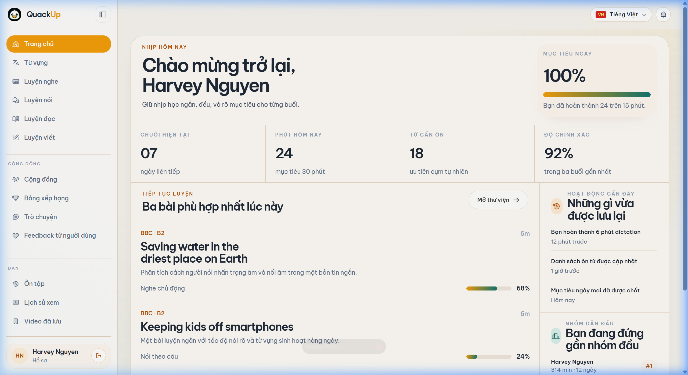
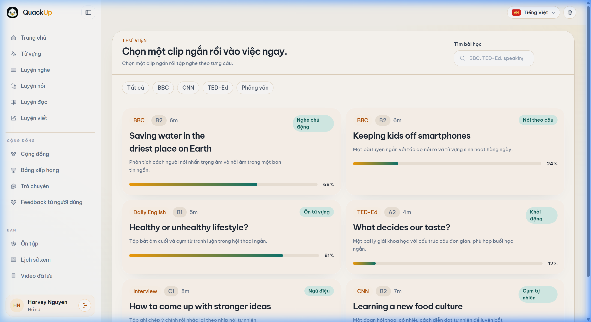
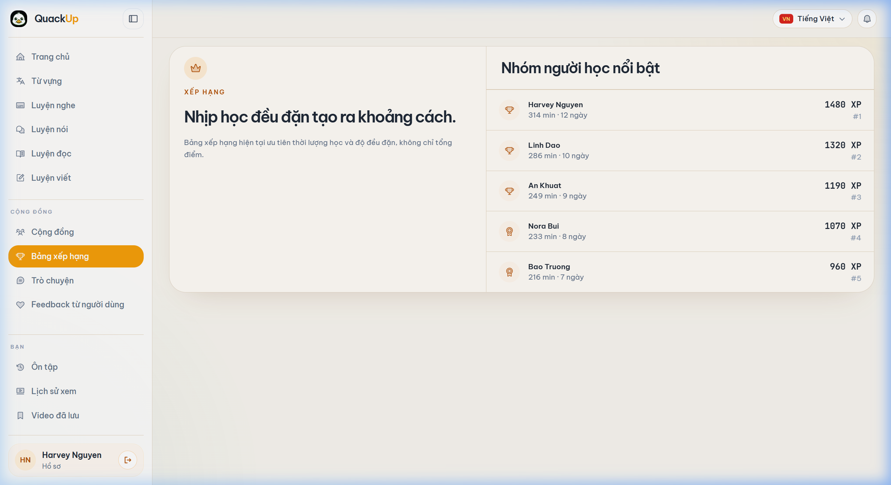
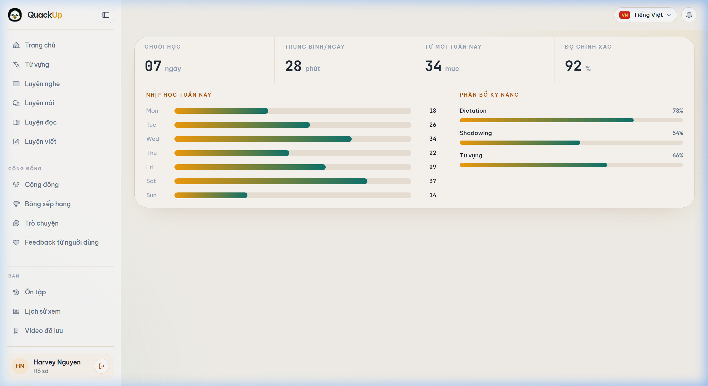

# App English — Web Frontend Documentation

> **React + Vite + Tailwind CSS**  
> Modern Web App  
> Local development: **http://localhost:5173**

---

## 📸 Giao diện thực tế (chụp từ app đang chạy)

| Dashboard | Thư Viện |
|-----------|----------|
|  |  |

| Xếp Hạng | Thống Kê |
|----------|----------|
|  |  |

---

## 🚀 Hướng dẫn chạy

### Yêu cầu

| Công cụ | Phiên bản | Ghi chú |
|---------|-----------|---------|
| Node.js | v18+ | `node -v` |
| npm | v9+ | `npm -v` |

### Lệnh chạy

```powershell
cd D:\work\web_app\App_English\frontend\web_app

# Cài đặt dependencies (nếu chưa có)
npm install

# Start development server
npm run dev
```

---

## 🗂️ Cấu trúc thư mục

```text
frontend/web_app/
├── public/                 ← Assets tĩnh (favicon, v.v.)
├── src/
│   ├── app/                ← Root App + Navigation config
│   ├── components/
│   │   ├── app/            ← Layout components (Sidebar, Topbar)
│   │   ├── common/         ← Shared UI components (Buttons, Inputs)
│   │   └── providers/      ← Context providers
│   ├── data/               ← Mock data / constants
│   ├── hooks/              ← Custom React hooks
│   ├── layouts/            ← AppShell & PublicLayout
│   ├── lib/                ← Utilities & API base
│   ├── pages/
│   │   ├── app/            ← Authenticated pages
│   │   ├── auth/           ← Login/Register
│   │   └── public/         ← Landing page
│   ├── repositories/       ← Data fetch logic
│   └── styles/             ← Tailwind base & custom CSS
├── tailwind.config.js      ← Design system tokens
└── vite.config.js          ← Vite settings
```

---

## 🏗️ Kiến trúc & Luồng Navigation

Frontend được phân tách rõ ràng thành 2 vùng chính thông qua `App.jsx`:

### 1. Public Area
- **Route:** `/`, `/login`, `/register`
- **Layout:** `PublicLayout.jsx`
- **Mục đích:** Landing page và xác thực người dùng.

### 2. Authenticated Area (App Shell)
- **Route:** `/dashboard`, `/learning`, `/dictation`, v.v.
- **Layout:** `AppShell.jsx`
- **Cấu trúc:**
    - `Sidebar`: Điều hướng chính (expandable).
    - `Topbar`: Breadcrumbs, Locale picker, Notifications.
    - `Main Content`: Render nội dung thông qua `<Outlet />`.

---

## 🎨 Design System (`tailwind.config.js`)

Hệ thống sử dụng hệ màu đồng bộ với Mobile App:

- **Colors:** `brand` (Orange), `sage` (Teal), `ink` (Dark Slate), `sand` (Off-white).
- **Typography:** `Be Vietnam Pro` (Sans), `JetBrains Mono` (Mono).
- **Radius:** `shell` (2rem), `panel` (1.5rem).
- **Shadow:** `panel` shadows được tinh chỉnh hướng mềm mại.

Các giá trị này được map vào class Tailwind giúp phát triển UI cực nhanh và thống nhất.

---

## ⏱️ Trạng thái hiện tại

| Trang | Trạng thái | Dữ liệu |
|-------|------------|---------|
| Dashboard | ✅ Hoàn chỉnh | Mock |
| Thư viện | ✅ Hoàn chỉnh | Mock |
| Xếp hạng | ✅ Hoàn chỉnh | Mock |
| Thống kê | ✅ Hoàn chỉnh | Mock |
| Luyện nghe | [/] Đang hoàn thiện | Mock |
| Shadowing | 🔲 Chờ tích hợp | — |

---

## 🗺️ Bước tiếp theo

1. **Kết nối API thật:** Chuyển đổi từ `mockContentRepository` sang gọi NestJS API.
2. **Xử lý Audio/Video:** Hoàn thiện Player cho bài học nghe và Dictation.
3. **PWA Support:** Cho phép cài đặt web app như một ứng dụng trên desktop.
4. **Dark Mode:** Mở rộng bảng màu cho chế độ tối.
