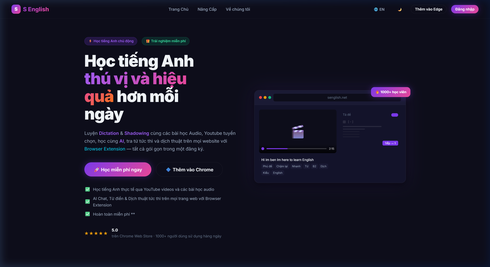
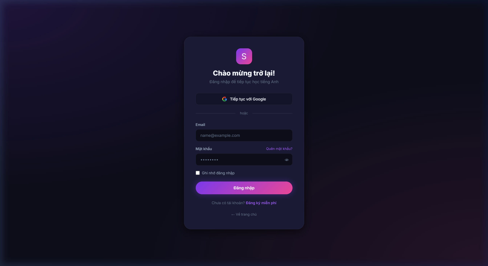
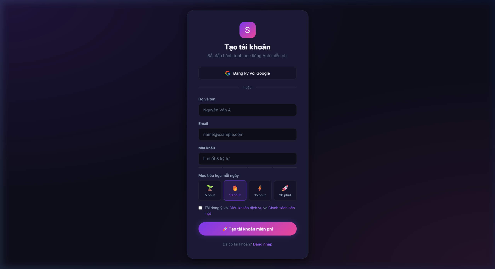
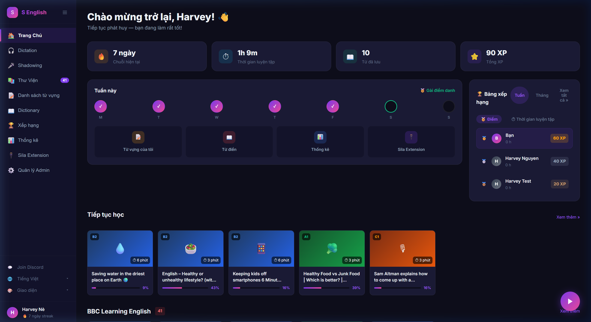
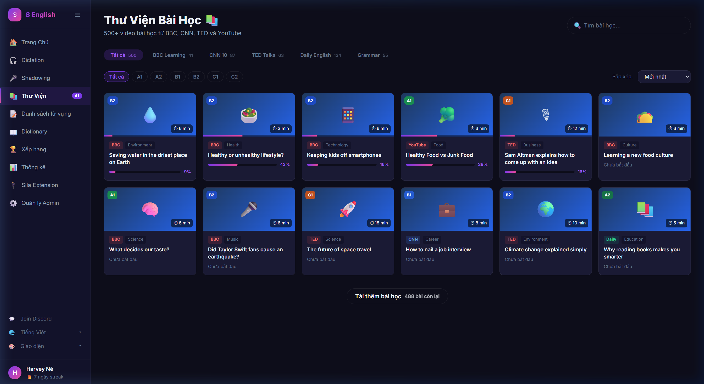
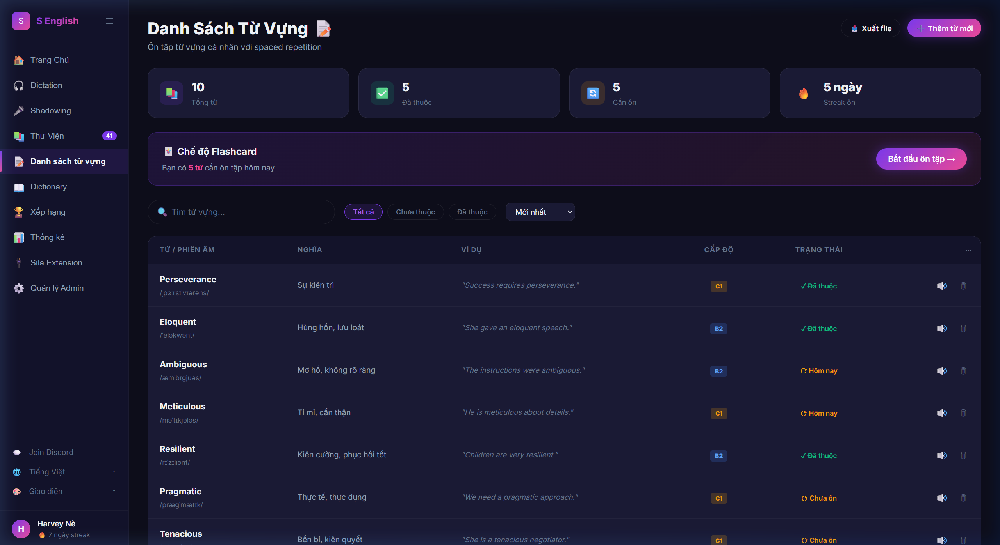
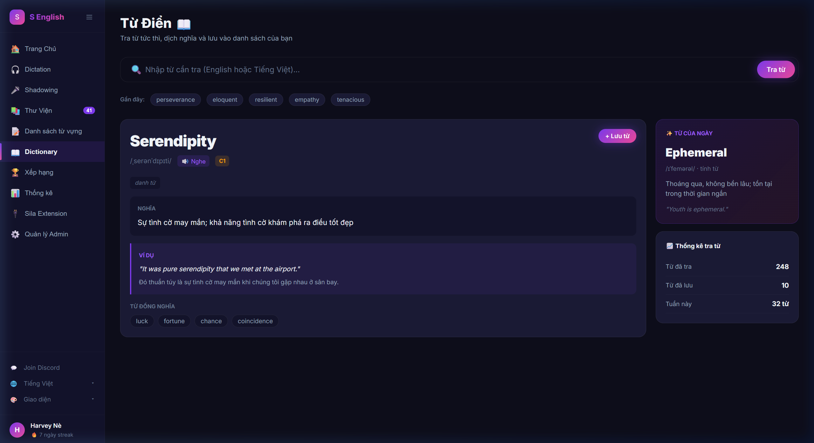
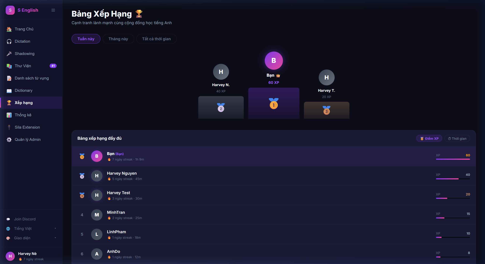
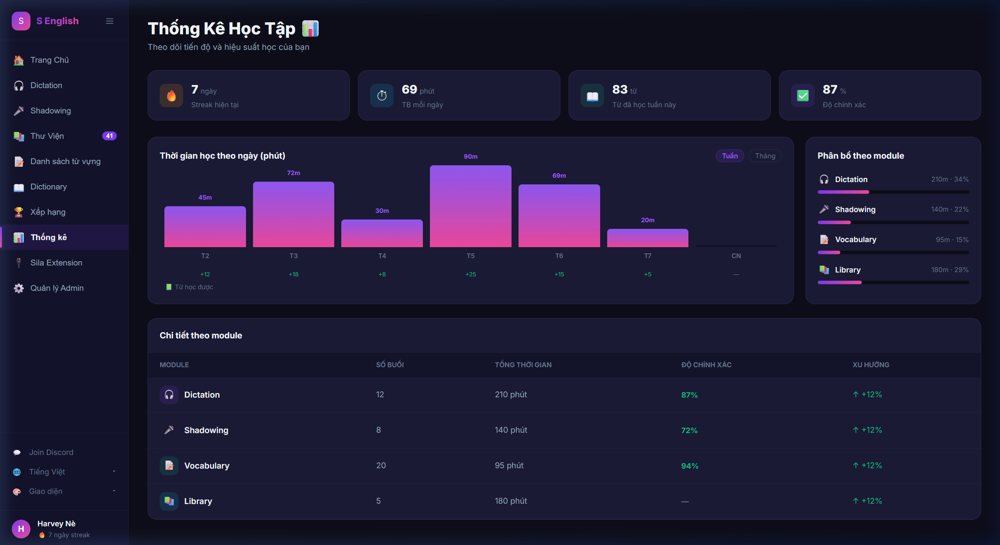
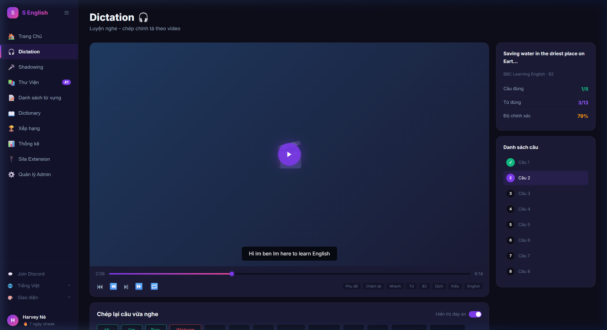

# App English — Frontend Documentation

> Tài liệu hướng dẫn cài đặt, chạy và cấu trúc thành phần của **App English Frontend Web App**  
> Stack: **Vanilla JS + Vite** · Dark theme · SPA Router · Không cần backend để chạy

---

## 📦 Yêu cầu môi trường

| Công cụ | Phiên bản tối thiểu | Kiểm tra |
|---------|---------------------|----------|
| Node.js | v18+ | `node -v` |
| npm     | v9+  | `npm -v`  |

---

## 🚀 Hướng dẫn chạy

### Bước 1 — Vào thư mục frontend

```powershell
cd D:\work\web_app\App_English\frontend\web_app
```

### Bước 2 — Cài thư viện (chỉ cần làm 1 lần)

```powershell
npm install
```

> ✅ Sẽ tạo ra thư mục `node_modules/` với Vite và các dependency

### Bước 3 — Chạy dev server

```powershell
npm run dev
```

> Trình duyệt tự mở tại **http://localhost:5173**  
> Hot reload — lưu file là trang tự refresh

### Các lệnh khác

```powershell
npm run build    # Build production (tạo thư mục dist/)
npm run preview  # Xem bản build production tại localhost:4173
```

---

## 🗂️ Cấu trúc thư mục

```
frontend/web_app/
│
├── index.html               ← Entry point HTML duy nhất (SPA)
├── package.json             ← Khai báo dependencies + scripts
├── vite.config.js           ← Cấu hình Vite (port, publicDir...)
│
├── public/
│   └── favicon.svg          ← Icon tab trình duyệt (gradient S)
│
└── src/
    ├── main.js              ← Bootstrap app: import CSS, khởi động router
    ├── router.js            ← SPA Router: map URL → page render function
    │
    ├── styles/
    │   └── main.css         ← Design system đầy đủ (biến CSS, layout, components)
    │
    ├── components/
    │   └── Sidebar.js       ← Sidebar dùng chung cho tất cả app pages
    │
    └── pages/
        ├── landing.js       ← /          (Trang chủ giới thiệu)
        ├── login.js         ← /login     (Đăng nhập)
        ├── register.js      ← /register  (Đăng ký)
        ├── dashboard.js     ← /dashboard (Trang chính sau login)
        ├── learning.js      ← /learning  (Thư viện bài học)
        ├── vocabulary.js    ← /vocabulary (Danh sách từ vựng)
        ├── dictionary.js    ← /dictionary (Từ điển)
        ├── leaderboard.js   ← /leaderboard (Xếp hạng)
        ├── statistics.js    ← /statistics  (Thống kê học tập)
        └── dictation.js     ← /dictation   (Luyện Dictation)
```

---

## 🏗️ Kiến trúc & Phân tầng

### Tầng 1 — Entry Point

```
index.html  →  src/main.js
```

`main.js` làm 3 việc:
1. Import CSS design system
2. Khởi động `router.render()` lần đầu
3. Lắng nghe click `[data-link]` và sự kiện `popstate` (back/forward)

---

### Tầng 2 — Router (SPA)

```
src/router.js
```

- Map mỗi URL path → một hàm render tương ứng
- Không dùng thư viện ngoài, tự viết bằng `history.pushState`
- Sau mỗi lần render, gọi `attachPageScripts(path)` để gắn event listeners

```
URL /dashboard  →  renderDashboard()  →  innerHTML của #root
URL /vocabulary →  renderVocabulary() →  innerHTML của #root
...
```

---

### Tầng 3 — Pages (10 trang)

Mỗi page là một hàm `async` trả về HTML string. Tất cả dùng mock data tĩnh, chưa kết nối backend.

#### Nhóm 1 — Public (không cần login)

| Page | Route | Mô tả |
|------|-------|-------|
| Landing | `/` | Giới thiệu sản phẩm, hero section, features, CTA |
| Login | `/login` | Form đăng nhập, Google OAuth mock |
| Register | `/register` | Form đăng ký + chọn mục tiêu học |

#### Nhóm 2 — App Pages (sau login, có Sidebar)

| Page | Route | Mô tả | Components |
|------|-------|-------|-----------|
| Dashboard | `/dashboard` | Trang chính: stats, weekly, leaderboard, lessons | Sidebar, StatCard, WeekDot, LessonCard |
| Learning  | `/learning`  | Thư viện 500+ video, filter theo level/nguồn | Sidebar, LessonGrid |
| Vocabulary| `/vocabulary`| Danh sách từ cá nhân, flashcard mode | Sidebar, VocabTable |
| Dictionary| `/dictionary`| Tra từ tức thì, word of day | Sidebar, WordCard |
| Leaderboard| `/leaderboard`| Podium top 3, bảng xếp hạng XP | Sidebar, LbTable |
| Statistics | `/statistics` | Bar chart tuần, module breakdown | Sidebar, BarChart |
| Dictation  | `/dictation`  | Video player + word input boxes | Sidebar, VideoPlayer |

---

### Tầng 4 — Shared Component

```
src/components/Sidebar.js
```

Sidebar được **tái sử dụng** ở tất cả app pages. Nhận tham số `activePage` để highlight mục đang chọn.

```js
renderSidebar('dashboard')   // highlight Trang Chủ
renderSidebar('vocab')       // highlight Danh sách từ vựng
renderSidebar('dict')        // highlight Dictionary
```

---

### Tầng 5 — Design System

```
src/styles/main.css
```

Toàn bộ design token, layout, và component styles được định nghĩa tập trung:

```css
/* Color palette */
--bg-primary:    #0d0d1a    /* nền chính */
--bg-card:       #1a1a35    /* nền card */
--accent-purple: #7c3aed    /* màu chính */
--accent-pink:   #ec4899    /* màu phụ */

/* Key CSS classes */
.page-landing    /* layout landing */
.page-auth       /* layout login/register */
.page-app        /* layout sidebar + content */
.sidebar         /* thanh điều hướng trái */
.main-content    /* vùng nội dung phải */
.stat-card       /* thẻ thống kê */
.lesson-card     /* thẻ bài học */
.card            /* container chung */
.btn-primary     /* nút gradient */
```

---

## 🖼️ Giao diện từng trang

### 1. Landing Page — `/`



**Thành phần:**
- Navbar cố định (logo, links, CTA buttons)
- Hero section: headline lớn + preview window mock + badges
- Features grid 3x2: Dictation, Shadowing, Thư viện, Từ vựng, AI Chat, Extension
- Stats banner: 1000+ users, 500+ videos, 5.0 ⭐
- CTA section: gradient background
- Footer

---

### 2. Login — `/login`



**Thành phần:**
- Card trung tâm (glassmorphism)
- Logo + tagline
- Google OAuth button
- Form: email + password + toggle hiện/ẩn
- Checkbox "Ghi nhớ đăng nhập"
- Link sang Register

---

### 3. Register — `/register`



**Thành phần:**
- Card trung tâm
- Google OAuth button
- Form: tên, email, password + strength meter
- Daily goal picker (5/10/15/20 phút)
- Checkbox Terms & Conditions
- Link sang Login

---

### 4. Dashboard — `/dashboard`



**Thành phần:**
- Sidebar trái (10 nav items + user info)
- Greeting header
- Stats row: 🔥 Streak · ⏱ Thời gian · 📖 Từ đã lưu · ⭐ XP
- Card trái: Weekly dots (M→S) + Quick actions (4 cards)
- Card phải: Leaderboard (tabs Tuần/Tháng)
- "Tiếp tục học": horizontal scroll lesson cards
- "BBC Learning English": thêm lesson cards
- Floating play button (góc dưới phải)

---

### 5. Thư Viện — `/learning`



**Thành phần:**
- Header + search bar
- Category tabs: Tất cả / BBC / CNN / TED / Daily / Grammar
- Level filter pills: A1 → C2
- Sort dropdown
- Lesson grid (auto-fill, 5 cột)
- Load more button

---

### 6. Từ Vựng — `/vocabulary`



**Thành phần:**
- Stats mini: Tổng từ / Đã thuộc / Cần ôn / Streak ôn
- Flashcard mode banner (CTA nổi bật)
- Filter bar: search + All/Chưa thuộc/Đã thuộc + Sort
- Bảng từ vựng: Từ | Nghĩa | Ví dụ | Cấp độ | Trạng thái | Actions

---

### 7. Từ Điển — `/dictionary`



**Thành phần:**
- Search bar lớn + nút "Tra từ"
- Recent searches pills
- Word card (2/3): từ lớn, phiên âm, nghĩa, ví dụ, từ đồng nghĩa
- Sidebar (1/3): Word of Day + stats tra từ

---

### 8. Xếp Hạng — `/leaderboard`



**Thành phần:**
- Tab: Tuần / Tháng / Tất cả thời gian
- Podium top 3 (hình ảnh trực quan)
- Bảng xếp hạng đầy đủ: avatar, tên, streak, XP bar
- Tab chuyển: Điểm XP / Thời gian

---

### 9. Thống Kê — `/statistics`



**Thành phần:**
- Overview stats: Streak / TB phút/ngày / Từ học / Độ chính xác
- Bar chart: thời gian học theo ngày trong tuần
- Module breakdown: progress bar mỗi module
- Detail table: sessions, tổng thời gian, accuracy, xu hướng

---

### 10. Dictation — `/dictation`



**Thành phần:**
- Video player mock: thumbnail, subtitle overlay, progress bar, controls
- Speed/mode buttons: Phụ đề / Chậm lại / Nhanh / B2 / Dịch
- Input row: ô nhập cho từng từ (màu xanh = đúng, đỏ = sai)
- Progress: X/8 câu, nút "Tiếp →"
- Panel phải: session stats + danh sách câu có trạng thái

---

## 🔗 Luồng Navigation

```
/  (Landing)
 ├── [Đăng nhập]    →  /login
 ├── [Đăng ký]      →  /register
 └── [Xem demo]     →  /dashboard

/login
 └── [Đăng nhập]   →  /dashboard (mock)

/dashboard (Sidebar)
 ├── Trang Chủ      →  /dashboard
 ├── Dictation      →  /dictation
 ├── Thư Viện       →  /learning
 ├── Danh sách TV   →  /vocabulary
 ├── Dictionary     →  /dictionary
 ├── Xếp hạng       →  /leaderboard
 └── Thống kê       →  /statistics
```

---

## 🎨 Design System tóm tắt

| Token | Giá trị | Dùng cho |
|-------|---------|----------|
| `--bg-primary` | `#0d0d1a` | Nền app chính |
| `--bg-card` | `#1a1a35` | Cards, panels |
| `--accent-purple` | `#7c3aed` | Màu chủ đạo |
| `--accent-pink` | `#ec4899` | Gradient pair |
| `--text-primary` | `#f1f5f9` | Text chính |
| `--text-secondary` | `#94a3b8` | Text phụ |
| Font | **Inter** | Toàn bộ app |

---

## 📋 Trạng thái hiện tại

| Trang | Status | Data |
|-------|--------|------|
| Landing | ✅ Hoàn chỉnh | Static |
| Login | ✅ Hoàn chỉnh | Mock |
| Register | ✅ Hoàn chỉnh | Mock |
| Dashboard | ✅ Hoàn chỉnh | Mock |
| Learning | ✅ Hoàn chỉnh | Mock (12 bài) |
| Vocabulary | ✅ Hoàn chỉnh | Mock (10 từ) |
| Dictionary | ✅ Hoàn chỉnh | Mock |
| Leaderboard | ✅ Hoàn chỉnh | Mock |
| Statistics | ✅ Hoàn chỉnh | Mock |
| Dictation | ✅ Hoàn chỉnh | Mock |
| Shadowing | 🔲 Placeholder | — |
| Admin | 🔲 Placeholder | — |

---

## 🗺️ Bước tiếp theo (Phase 2+)

```
Phase 2 — Backend NestJS
 └── Auth API, User API, Lesson API

Phase 3 — Database PostgreSQL + Prisma
 └── Schema, Migrations, Seed data

Phase 4 — Infrastructure
 └── Docker Compose, Nginx, Ubuntu deploy

Phase 5 — Integration
 └── Kết nối frontend ↔ backend thật
 └── Thay mock data bằng API calls
```
