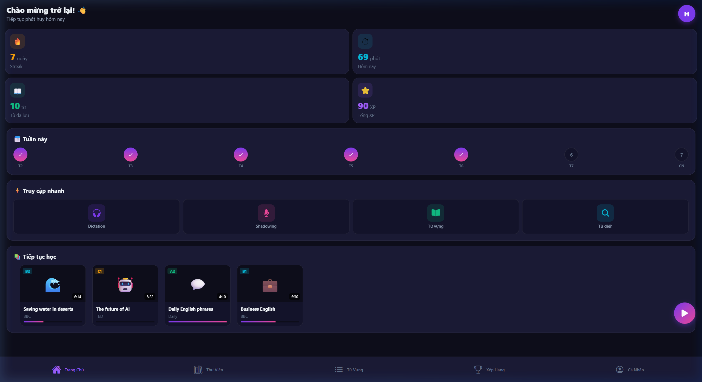
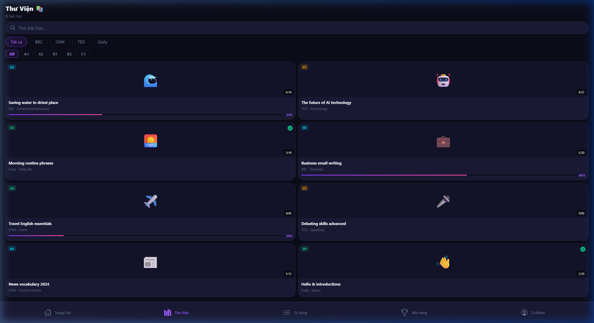
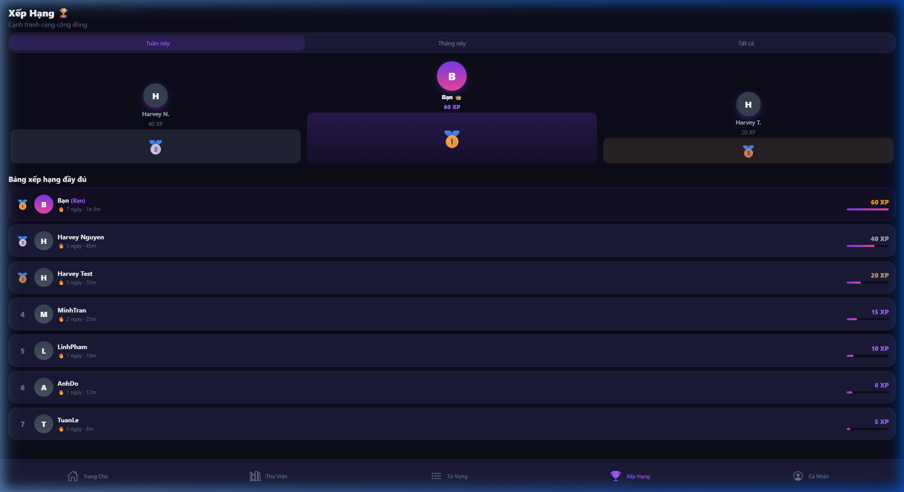
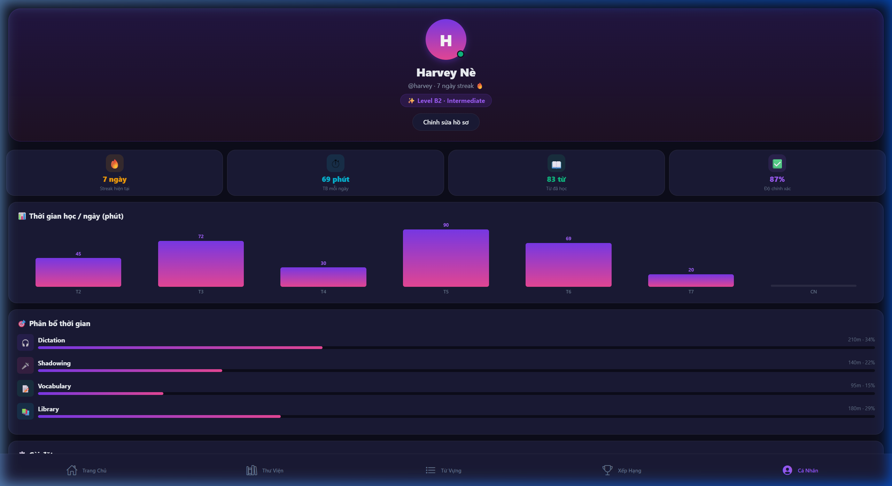

# App English — Mobile App Documentation

> **React Native + Expo + TypeScript**  
> Cross-platform: iOS & Android  
> Xem trên web: **http://localhost:8083**

---

## 📸 Giao diện thực tế (chụp từ app đang chạy)

| Dashboard | Thư Viện |
|-----------|----------|
|  |  |

| Xếp Hạng | Cá Nhân |
|----------|----------|
|  |  |

---

## 🚀 Hướng dẫn chạy

### Yêu cầu

| Công cụ | Phiên bản | Ghi chú |
|---------|-----------|---------|
| Node.js | v18+ | `node -v` |
| npm | v9+ | `npm -v` |
| Expo Go | latest | Cài trên điện thoại |

### Lệnh chạy

```powershell
cd D:\work\web_app\App_English\frontend\mobile_app

# Start development server
npx expo start --port 8081

# Chỉ Android (dùng emulator)
npx expo start --android

# Chỉ iOS (cần macOS)
npx expo start --ios
```

### Xem app trên điện thoại thật

1. Cài **Expo Go** từ App Store / Play Store  
2. Chạy `npx expo start`  
3. Dùng camera quét **QR code** trên terminal  
4. App tự load trên điện thoại ✅

---

## 🗂️ Cấu trúc thư mục

```
mobile_app/
│
├── App.tsx                          ← Entry point, mount StatusBar + Navigator
├── app.json                         ← Expo config (name, icon, splash, iOS/Android)
├── babel.config.js                  ← Babel preset expo
├── tsconfig.json                    ← TypeScript config
├── package.json                     ← Dependencies
│
├── assets/                          ← icon.png, splash, adaptive-icon
│
└── src/
    ├── theme/
    │   └── tokens.ts                ← Design system (Colors, Spacing, Radius, FontSize, Shadow)
    │
    ├── navigation/
    │   └── AppNavigator.tsx         ← Bottom Tab + Auth Stack navigators
    │
    └── screens/
        ├── DashboardScreen.tsx      ← Trang chủ (home tab)
        ├── LearningScreen.tsx       ← Thư viện bài học
        ├── VocabularyScreen.tsx     ← Danh sách từ vựng
        ├── LeaderboardScreen.tsx    ← Xếp hạng
        ├── ProfileScreen.tsx        ← Cá nhân + thống kê
        └── auth/
            ├── LoginScreen.tsx      ← Đăng nhập
            └── RegisterScreen.tsx   ← Đăng ký
```

---

## 🏗️ Kiến trúc

```
App.tsx
  └── AppNavigator.tsx
        ├── (isLoggedIn = true)  → AppTabs (Bottom Tab)
        │     ├── Tab 1: DashboardScreen   (🏠 Trang Chủ)
        │     ├── Tab 2: LearningScreen    (📚 Thư Viện)
        │     ├── Tab 3: VocabularyScreen  (📝 Từ Vựng)
        │     ├── Tab 4: LeaderboardScreen (🏆 Xếp Hạng)
        │     └── Tab 5: ProfileScreen     (👤 Cá Nhân)
        │
        └── (isLoggedIn = false) → AuthStack
              ├── LoginScreen
              └── RegisterScreen
```

---

## 📱 Các Screens

### 1. DashboardScreen — Tab Trang Chủ

**Route:** Bottom Tab #1 `🏠`


**Thành phần:**
- Greeting header + avatar
- Stats 2×2 grid: Streak / Thời gian / Từ / XP
- Weekly streak dots (LinearGradient khi done)
- Quick Actions 4 cols: Dictation / Shadowing / Từ vựng / Từ điển
- Horizontal scroll lesson cards với progress bar
- Floating Action Button (gradient circle)

---

### 2. LearningScreen — Tab Thư Viện

**Route:** Bottom Tab #2 `📚`


**Thành phần:**
- Search bar có clear button
- Category pills horizontal: Tất cả / BBC / CNN / TED / Daily
- Level filter pills: All / A1 / A2 / B1 / B2 / C1
- FlatList 2-column lesson grid
- Mỗi card: emoji thumb, level badge, duration, progress bar
- Empty state khi không có kết quả

---

### 3. VocabularyScreen — Tab Từ Vựng

**Route:** Bottom Tab #3 `📝`

**Thành phần:**
- Stats row: Tổng / Thuộc / Cần ôn
- Flashcard CTA banner (màu purple)
- Search bar
- FlatList word cards: từ, phiên âm, nghĩa, level badge, status badge, 🔊

---

### 4. LeaderboardScreen — Tab Xếp Hạng

**Route:** Bottom Tab #4 `🏆`


**Thành phần:**
- 3-tab selector: Tuần / Tháng / Tất cả
- Podium visual top 3 (gradient bars, height tỷ lệ)
- FlatList full ranking với XP bar
- Row highlight cho "Bạn"

---

### 5. ProfileScreen — Tab Cá Nhân

**Route:** Bottom Tab #5 `👤`


**Thành phần:**
- Profile card gradient: avatar lớn, tên, level badge
- Stats overview 2×2
- Weekly bar chart (inline, không dùng thư viện ngoài)
- Module breakdown với progress bars
- Settings list: Thông báo / Dark mode / Ngôn ngữ / Đăng xuất

---

### 6. LoginScreen — Auth Screen

**Route:** Auth Stack (khi chưa đăng nhập)

**Thành phần:**
- Logo gradient + app name
- Google OAuth button
- Email + Password inputs
- Show/hide password toggle
- Forgot password link
- Redirect sang Register

---

### 7. RegisterScreen — Auth Screen

**Route:** Auth Stack

**Thành phần:**
- Tên / Email / Password
- Password strength meter (3 bars)
- Daily goal picker: 5 / 10 / 15 / 20 phút
- CTA button gradient
- Redirect sang Login

---

## 🎨 Design System (`src/theme/tokens.ts`)

```typescript
Colors.bgPrimary    = '#0d0d1a'   // nền chính
Colors.bgCard       = '#1a1a35'   // cards
Colors.purple       = '#7c3aed'   // accent chính
Colors.pink         = '#ec4899'   // accent phụ
Colors.textPrimary  = '#f1f5f9'   // text trắng

Spacing.lg  = 16
Radius.lg   = 16
FontSize.base = 14
Shadow.purple = { shadowColor: '#7c3aed', ... }
```

**Thống nhất hoàn toàn với web app** — cùng màu, cùng tỷ lệ.

---

## 📦 Dependencies chính

| Package | Version | Mục đích |
|---------|---------|---------|
| `expo` | ~54.0.0 | Framework |
| `react-native` | 0.76.6 | Core |
| `@react-navigation/native` | ^6 | Navigation |
| `@react-navigation/bottom-tabs` | ^6 | Tab bar |
| `@react-navigation/stack` | ^6 | Stack nav |
| `expo-linear-gradient` | ~14.0 | Gradients |
| `@expo/vector-icons` | ^14 | Ionicons |
| `react-native-safe-area-context` | 4.12 | Safe areas |
| `react-native-screens` | ~4.4 | Performance |

---

## ⏱️ Trạng thái hiện tại

| Screen | Status | Data |
|--------|--------|------|
| DashboardScreen | ✅ Hoàn chỉnh | Mock |
| LearningScreen | ✅ Hoàn chỉnh | Mock (8 bài) |
| VocabularyScreen | ✅ Hoàn chỉnh | Mock (8 từ) |
| LeaderboardScreen | ✅ Hoàn chỉnh | Mock |
| ProfileScreen | ✅ Hoàn chỉnh | Mock |
| LoginScreen | ✅ Hoàn chỉnh | Mock |
| RegisterScreen | ✅ Hoàn chỉnh | Mock |
| DictationScreen | 🔲 Chưa build | — |
| DictionaryScreen | 🔲 Chưa build | — |

---

## 🗺️ Bước tiếp theo

```
Phase 2 — Backend NestJS API
  → Kết nối auth thật (JWT)
  → Lesson API, Vocabulary API

Phase 3 — Push Notification
  → expo-notifications
  → Nhắc lịch học hàng ngày

Phase 4 — Offline mode
  → AsyncStorage
  → Cache bài học đã tải

Phase 5 — App Store / Play Store
  → EAS Build (Expo Application Services)
  → eas build --platform android
  → eas build --platform ios
```
