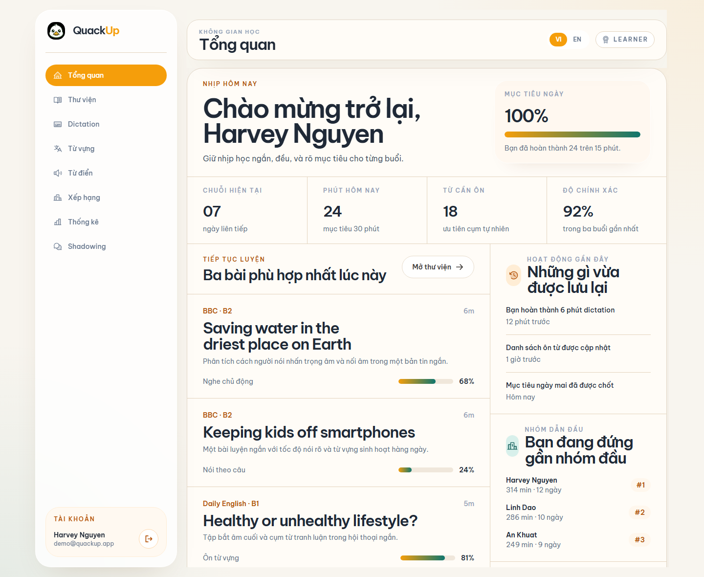
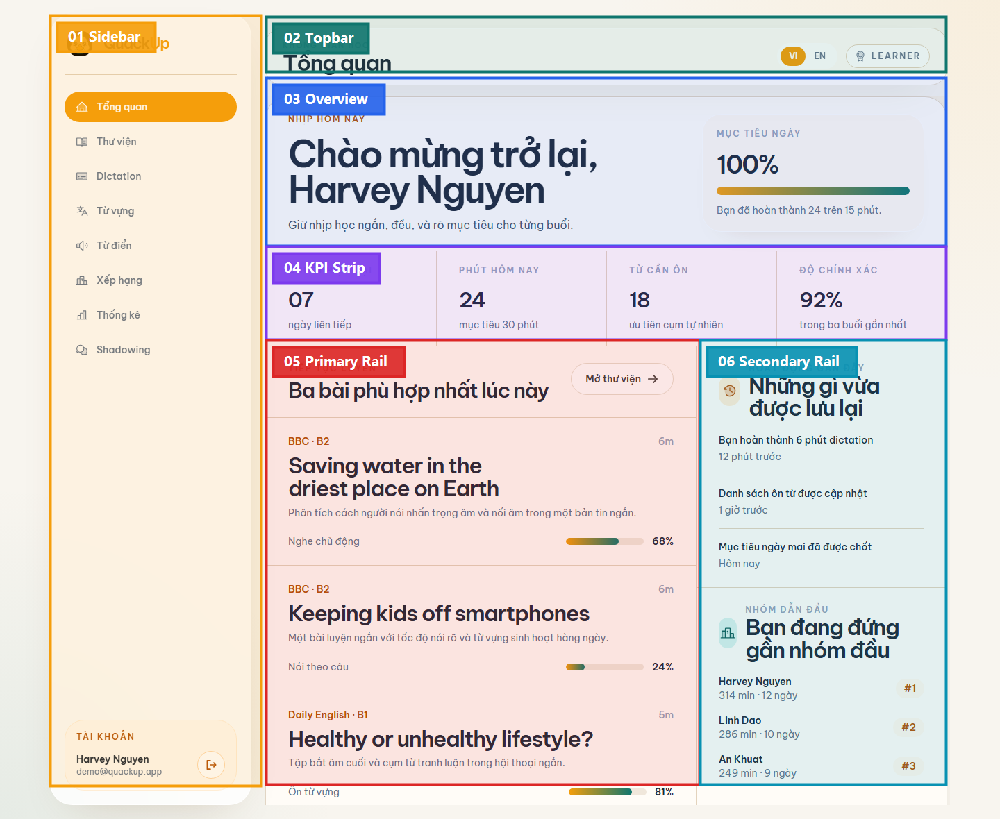
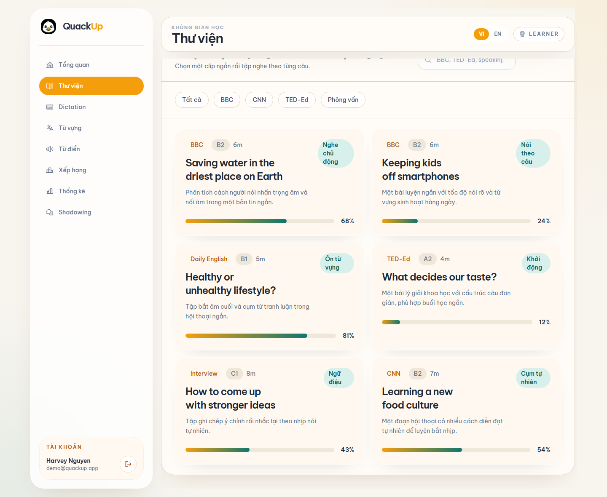
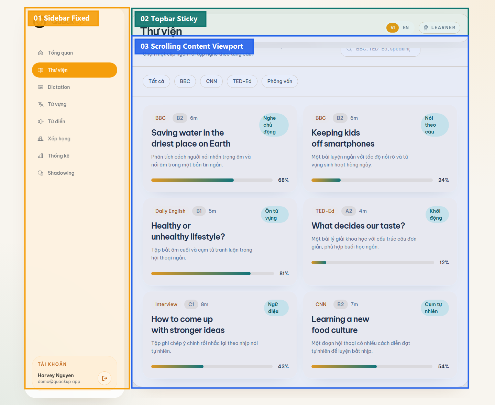

# Authenticated App Shell Architecture

Tài liệu này chốt cách tổ chức frontend **sau khi đăng nhập** theo hướng app shell thống nhất, dễ mở rộng và dễ cô lập thay đổi theo module.

## Mục tiêu

- Sidebar đứng yên.
- Topbar sticky trong workspace.
- Chỉ vùng nội dung chính cuộn.
- Page sau đăng nhập không còn là nhiều khối rời rạc tự nổi.
- Mỗi page cắm vào cùng một shell, nên các đợt chỉnh module sau này không phải đụng lại khung lớn.

## Ảnh chụp hiện tại

### Dashboard

### Dashboard annotated

### Learning scroll behavior

### Learning scroll annotated

## Vùng module đã chốt

### Dashboard map

| Mã | Vùng | Trách nhiệm | File chính hiện tại |
|---|---|---|---|
| 01 | Sidebar | điều hướng route, account dock, logout | `src/components/app/AppSidebar.jsx` |
| 02 | Topbar | page identity, locale toggle, role pill | `src/components/app/AppTopbar.jsx` |
| 03 | Overview | tóm tắt nhịp hôm nay + daily target | `src/pages/app/DashboardPage.jsx` |
| 04 | KPI Strip | các chỉ số nhanh trong ngày | `src/pages/app/DashboardPage.jsx` |
| 05 | Primary Rail | danh sách bài nên học tiếp | `src/pages/app/DashboardPage.jsx` |
| 06 | Secondary Rail | activity, leaderboard, note | `src/pages/app/DashboardPage.jsx` |

### Scroll map

| Mã | Vùng | Hành vi |
|---|---|---|
| 01 | Sidebar Fixed | đứng yên theo viewport |
| 02 | Topbar Sticky | bám trên cùng khi content cuộn |
| 03 | Scrolling Content Viewport | toàn bộ nội dung page app cuộn bên trong vùng này |

## Quy ước kỹ thuật

### 1. Shell

- `AppShell` chỉ chịu trách nhiệm:
  - chia 2 cột sidebar/workspace
  - điều khiển mobile drawer
  - reset scroll khi đổi route
  - giữ topbar sticky và viewport scroll riêng

### 2. Page app

- Page app không tự tạo layout toàn trang.
- Page app chỉ render nội dung bên trong `WorkspaceCanvas`.
- Nếu page cần 2 cột, chỉ chia bên trong canvas; không tạo thêm shell mới.

### 3. Primitive dùng chung

- `WorkspaceCanvas`: mặt phẳng chính của từng page sau đăng nhập
- `WorkspaceSection`: section con trong canvas
- `WorkspaceSectionHeader`: tiêu đề section có action

## File chính

- `frontend/web_app/src/layouts/AppShell.jsx`
- `frontend/web_app/src/components/app/AppSidebar.jsx`
- `frontend/web_app/src/components/app/AppTopbar.jsx`
- `frontend/web_app/src/components/app/WorkspaceCanvas.jsx`

## Quy tắc cho các đợt tiếp theo

- Chỉnh thẻ, nội dung, widget mới phải nằm trong canvas hiện có.
- Không quay lại kiểu mỗi cụm là một card tách biệt ngoài shell.
- Khi thêm page mới sau đăng nhập, ưu tiên tái sử dụng:
  - `AppShell`
  - `WorkspaceCanvas`
  - `WorkspaceSection`
- Nếu một module có thể hỏng độc lập trong phase sau, lúc đó mới thêm `ErrorBoundary` riêng cho module đó; vòng này chưa cần.
